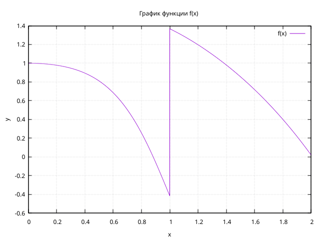
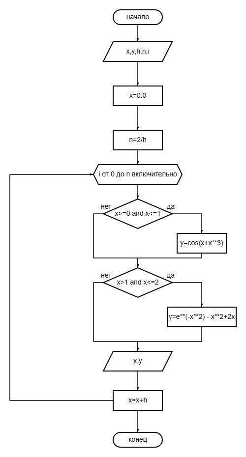

# Лабораторная работа №2.

### Задание:

### Ход работы:
$$ f(x) = 
  \begin{cases}
    cos(x + x ^ 3),    & \ 0\leq x \leq 1;\\
    e^{-x ^ 2} - x ^ 2 + 2x,    & \ 1 < x \leq 2\ . \end{cases}
$$
## Напишите программу, используя оператор цикла while:

## Напишите программу, используя оператор цикла for:

### Постройте график с использованием gnuplot:

### Составьте блок-схемы.
## Блок-схема для кода с циклом for.

