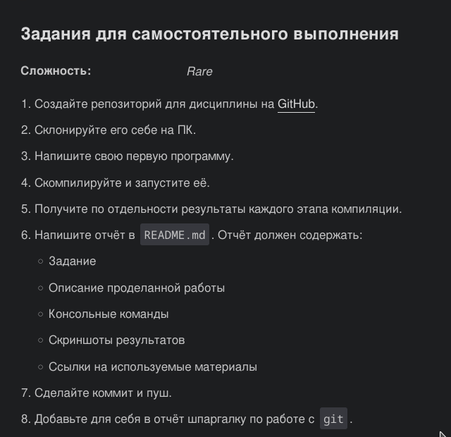
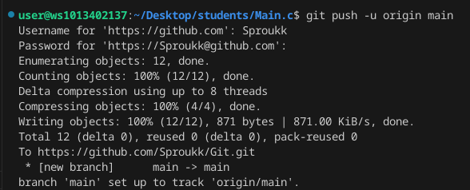
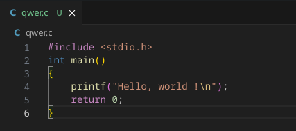
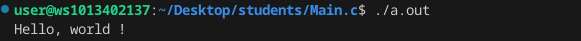
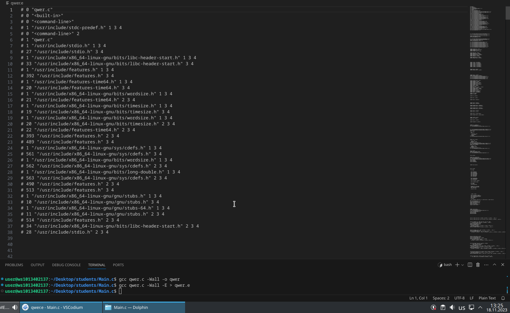
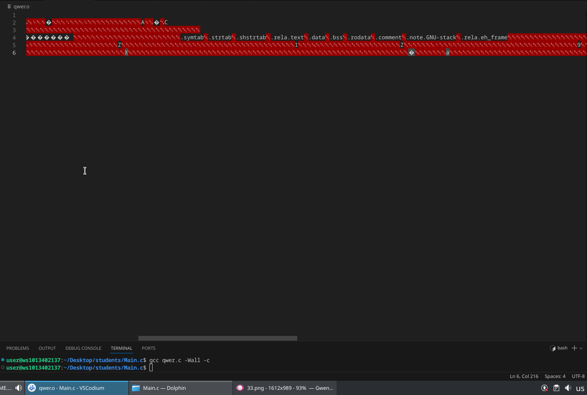
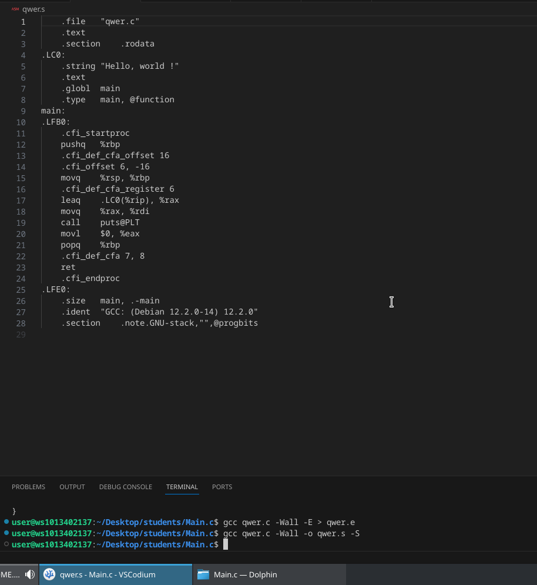

# Лабораторная работа №00
## Задание 



## 1. Ссылка на репозиторий:
https://github.com/Sproukk/Git/tree/main

## 2. Склонируйте его себе на пк:


## 3. Напишите свою первую программу:


## 4. Скомпилируйте и запустите её:



## 5. Препроцессор:



## 6. Компилятор:



## 7. Объектные файлы:




## Список использованных источников:
https://doka.guide/tools/markdown/

## Шпаргалки к:
```shell
git commit -m "first commit"
git push -u origin main
```

> Команда git commit делает для проекта снимок текущего состояния изменений, добавленных в раздел проиндексированных файлов. Такие подтвержденные снимки состояния можно рассматривать как "безопасные" версии проекта - Git не будет их менять, пока явным образом не попросите об этом.

> Команда git push позволяет отправить локальную ветку на удаленный репозиторий. Она помогает разработчикам синхронизироваться в команде, а именно отправляет проделанные изменения.


