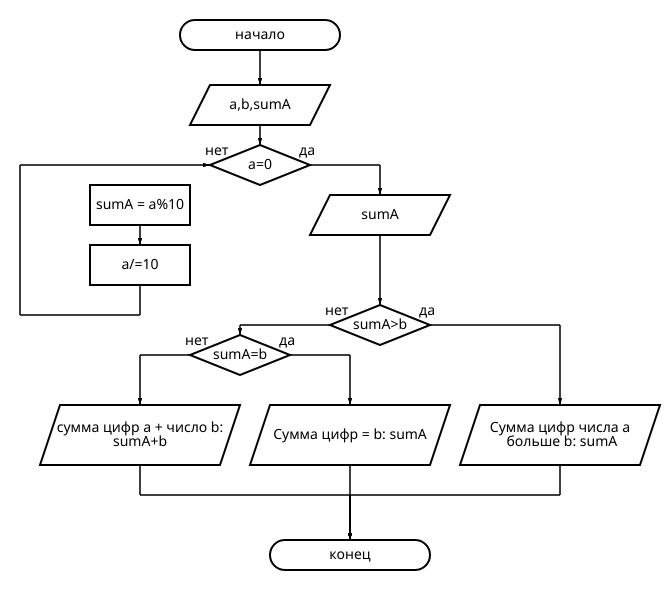

# Лабораторная работа №1
## Задание 1: Разобрать код программы из примера 
## Задание 2: Составить блок-схему алгоритма 


## Задание 3: Написать программу, решающую задачу по своему варианту
### Вариант 1: Вывести сумму цифр числа a если она больше b, если равна b - сообщение Сумма цифр = b, и значение суммы, увеличенное на b, если сумма меньше b.
### Программа:
```c
#include <stdio.h>

int main() {
int a, b;
printf("Введите число a: ");
scanf("%d", &a);
printf("Введите число b: ");
scanf("%d", &b);

int sumA = 0;
while (a != 0) {
sumA += a % 10;
a /= 10;
}

if (sumA > b) {
printf("Сумма цифр числа a больше b: %d\n", sumA);
} else if (sumA == b) {
printf("Сумма цифр числа а = b: %d\n", sumA);
} else {
int sumAB = sumA + b;
printf("Сумма цифр числа а меньше b, увеличенная на b: %d\n", sumAB);
}

return 0;
}
```

## Задание 4: Написать отчет в README.md
